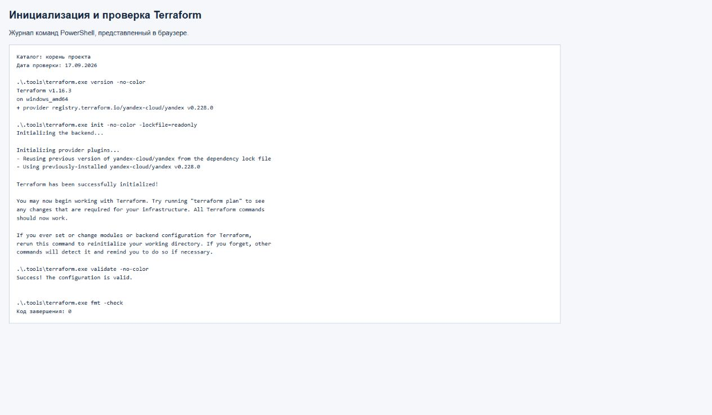
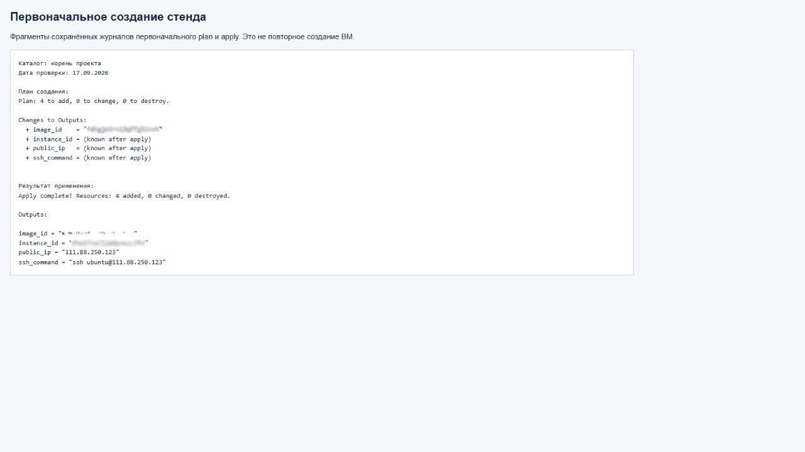
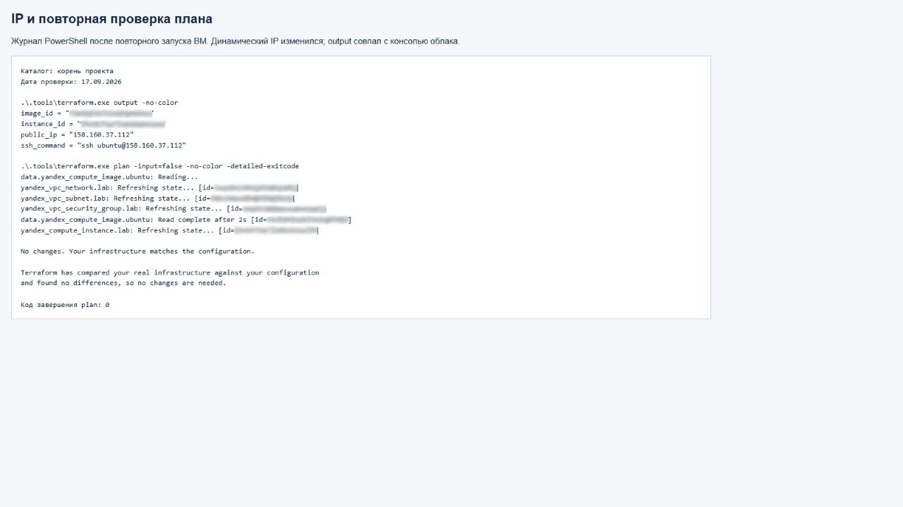
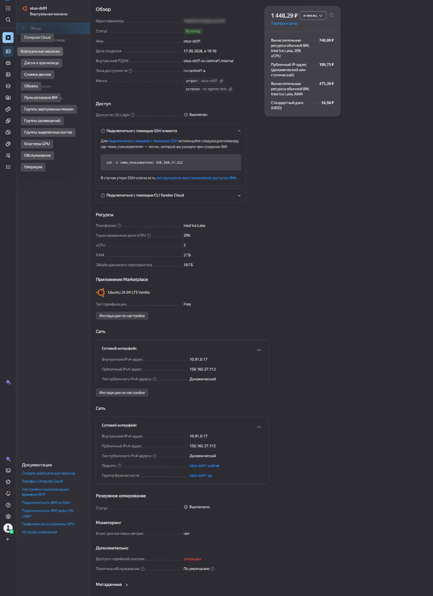
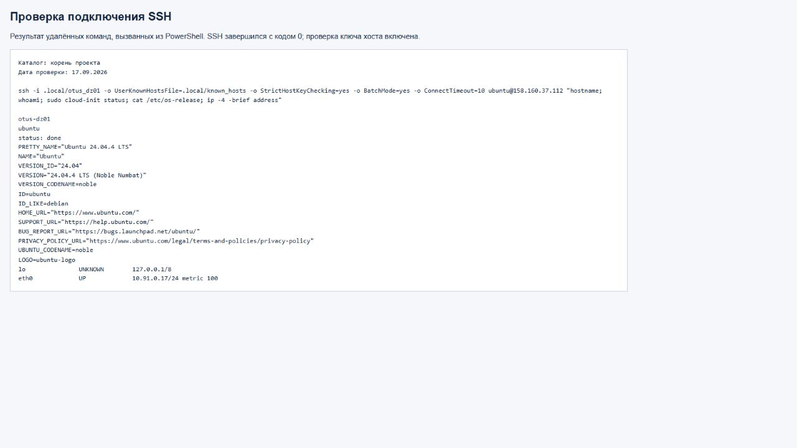

# ДЗ №1: Terraform и виртуальная машина в Yandex Cloud

Цель — освоить цикл IaC: описать инфраструктуру, проверить план, создать ВМ,
получить её IP и подключиться по SSH. В репозитории представлены конфигурация
Terraform, инструкции воспроизведения и результаты выполнения домашнего задания.

## Статус

Подготовлена конфигурация. 17 сентября 2026 успешно выполнены `terraform init`,
`terraform validate`, `terraform fmt -check` и `git diff --check` на Windows.
Установлены Terraform 1.16.3, Yandex provider 0.228.0 и yc 1.34.0.
Настроена авторизация yc. Выполнены `plan` и `apply`, создана ВМ,
успешно проверены SSH и cloud-init. Повторный `plan` после настройки SSH-доступа
показал `No changes`. Результаты ниже относятся к запуску 17 сентября 2026 года.
Скриншоты и журналы проверки приведены в разделе 6. После повторной проверки
ВМ штатно остановлена; подтверждён статус `STOPPED`.
Инструкция для Linux x86-64 приведена в разделе 8; полный цикл создания
и удаления с Linux-клиента в рамках этой работы не выполнялся.

## Что создаётся и почему

| Компонент | Настройка / назначение |
| --- | --- |
| Облако | Yandex Cloud, зона `ru-central1-a` в российском регионе |
| ВМ | `standard-v3`, 2 vCPU, 20% гарантированной доли CPU, 2 ГБ RAM |
| ОС | Ubuntu 24.04 LTS из семейства `ubuntu-2404-lts` |
| Диск | 10 ГБ, `network-hdd` |
| Сеть | Отдельная VPC и подсеть `10.91.0.0/24` |
| Публичный IPv4 | Динамический NAT-адрес для SSH и выхода в интернет |
| Security group | Входящий SSH только с IPv4 оператора `/32`; исходящий IPv4 разрешён |
| cloud-init | Пользователь `ubuntu`, публичный SSH-ключ, отключение парольного SSH |

Для этого стенда достаточно динамического IP.
При остановке/запуске динамический IP может измениться — повторно проверьте output и подключение по SSH.
Использование image family выбирает актуальный образ; его фактический ID выводится в output.

`provider` связывает Terraform с API облака, `resource` описывает управляемый объект,
`data` читает существующий образ, `variable` задаёт входные параметры, `output`
выводит результат. Ссылки между ресурсами задают порядок создания автоматически.
State хранит соответствие кода реальным объектам; его нужно сохранять локально,
но не публиковать в Git. `.terraform.lock.hcl`, напротив, следует включить в Git.

## 1. Инструменты Windows / PowerShell

Примеры рассчитаны на PowerShell в Windows и каталог
`C:\path\to\OTUS_DZ01` — условный путь. Замените его во всех командах
`Set-Location` на фактический каталог проекта.
Каждый блок PowerShell выполняется на локальном компьютере. Команды Bash
из раздела 5 выполняются внутри SSH-сессии на ВМ. Для локального Linux
используйте отдельную последовательность из раздела 8.

Для установки необходимы Python 3 и доступ в интернет; для подключения — OpenSSH Client.

```powershell
Set-Location "C:\path\to\OTUS_DZ01"
python scripts/install-tools.py
$env:TF_CLI_CONFIG_FILE = "$PWD\terraform.rc"
.\.tools\terraform.exe version
.\.tools\yc.exe version
```

Установка локальная, системный PATH не изменяется. Terraform 1.16.3 скачивается
с официального сервера с проверкой SHA256; yc — из официального HTTPS-дистрибутива.
`terraform.rc` использует зеркало Yandex для провайдера. При новом терминале повторите
команду настройки `TF_CLI_CONFIG_FILE` перед `terraform init`.
В примерах используются явные пути к исполняемым файлам в `.tools`, поэтому
добавление инструментов в системный PATH не требуется.

## 2. Облачный доступ

В консоли выберите облако с активным платёжным аккаунтом и создайте отдельный
каталог для ресурсов стенда. При воспроизведении выберите собственный каталог.
Сохраните cloud ID и folder ID — это идентификаторы, не токены.

Первичная авторизация yc:

```powershell
Set-Location "C:\path\to\OTUS_DZ01"
New-Item -ItemType Directory -Force .local | Out-Null
.\.tools\yc.exe --config "$PWD\.local\yc-config.yaml" init
```

Следуйте подсказкам CLI, выберите нужные облако и каталог. Не публикуйте вывод
с токенами и содержимое профиля. Профиль `.local` исключён из Git.

Для первого запуска можно использовать краткоживущий IAM-токен пользователя:

```powershell
Set-Location "C:\path\to\OTUS_DZ01"
$env:YC_TOKEN = & .\.tools\yc.exe --config "$PWD\.local\yc-config.yaml" iam create-token
if ($LASTEXITCODE -ne 0) { throw 'Не удалось получить IAM-токен' }
```

Получение IAM-токена необходимо повторить в новом терминале и после истечения
срока его действия перед командами `plan` и `apply`. Токен хранится только
в переменной окружения текущего процесса PowerShell.

Учётная запись должна иметь права на создание Compute/VPC ресурсов в выбранном каталоге.
Для дальнейшей автоматизации предпочтителен отдельный сервисный аккаунт с
`compute.editor` и `vpc.admin` только на этот каталог, и имперсонация вместо
долгоживущего ключа. Это отдельная настройка IAM; данный Terraform не создаёт IAM-роли.
Альтернатива для уже выданного ключа — `YC_SERVICE_ACCOUNT_KEY_FILE` с локальным
путём; не задавайте одновременно два способа авторизации.

## 3. SSH и параметры

Создайте отдельную пару ключей, если её ещё нет (существующий ключ не перезаписывайте):

```powershell
Set-Location "C:\path\to\OTUS_DZ01"
ssh-keygen -t ed25519 -f "$PWD\.local\otus_dz01" -C otus-dz01
Copy-Item terraform.tfvars.example terraform.tfvars
```

В `terraform.tfvars` заполните cloud/folder ID, путь к
`.local/otus_dz01.pub` и текущий публичный IPv4 оператора с `/32`.
Адрес `203.0.113.10` в примере — заполнитель. Укажите реальный внешний адрес
источника SSH-соединения. Приватный ключ в Terraform не передаётся.

В выполненной работе значения сохранены в локальном `terraform.tfvars.json`,
а публичный ключ — в `.local/operator.pub`; соответствующий приватный ключ —
`.local/otus_dz01`. Оба формата переменных поддерживаются Terraform.
Используйте один файл значений: `terraform.tfvars` либо `terraform.tfvars.json`,
чтобы не задавать одинаковые параметры в двух местах. При самостоятельном
воспроизведении создайте свою пару ключей и укажите свой путь к публичному ключу.

## 4. Проверки и создание

В текущем терминале должен быть получен IAM-токен по разделу 2.
Подготовка и просмотр плана:

```powershell
Set-Location "C:\path\to\OTUS_DZ01"
$env:TF_CLI_CONFIG_FILE = "$PWD\terraform.rc"
.\.tools\terraform.exe init
.\.tools\terraform.exe fmt -check
.\.tools\terraform.exe validate
.\.tools\terraform.exe plan '-out=.local/create.tfplan'
.\.tools\terraform.exe show -no-color .local/create.tfplan
```

Перед apply прочитайте план: ожидаются четыре создаваемых ресурса — сеть,
подсеть, security group, ВМ с загрузочным диском. Изменений существующей
инфраструктуры быть не должно. `apply` сохранённого плана не запрашивает подтверждение.
С этого момента оплачиваются ресурсы, включая диск и публичный IPv4.

Применение проверенного плана и вывод результатов:

```powershell
Set-Location "C:\path\to\OTUS_DZ01"
.\.tools\terraform.exe apply .local/create.tfplan
.\.tools\terraform.exe output
```

## 5. Проверка SSH и настройки

**SSH ограничён параметром `ssh_allowed_cidr`: подключение разрешено только
с указанного IPv4 `/32`. Доступ со всего Интернета не открывается.**
Знать публичный IP ВМ недостаточно: нужны разрешённый адрес источника и
приватный ключ, соответствующий установленному на ВМ публичному ключу.

Подключение из локального PowerShell:

```powershell
Set-Location "C:\path\to\OTUS_DZ01"
$vmAddress = & .\.tools\terraform.exe output -raw public_ip
ssh -i .local/otus_dz01 "ubuntu@$vmAddress"
```

При смене адреса оператора:

1. Определите внешний IPv4, с которого именно SSH-соединение приходит к ВМ.
2. В используемом локальном файле переменных измените `ssh_allowed_cidr`
   на этот адрес с `/32`. Для JSON запись выглядит как
   `"ssh_allowed_cidr": "203.0.113.10/32"`, где адрес необходимо заменить своим.
3. В локальном PowerShell обновите IAM-токен по разделу 2 при необходимости
   и проверьте план изменения:

   ```powershell
   Set-Location "C:\path\to\OTUS_DZ01"
   .\.tools\terraform.exe plan '-out=.local/ssh-access.tfplan'
   .\.tools\terraform.exe show -no-color .local/ssh-access.tfplan
   .\.tools\terraform.exe apply .local/ssh-access.tfplan
   ```

   При изменении только адреса ожидается обновление ingress группы безопасности
   без пересоздания ВМ. Если план содержит другие изменения, сначала разберите их.
   Применяйте сохранённый план только после проверки состава изменений.
4. Повторите SSH-подключение с тем же приватным ключом.

При выполнении ДЗ первоначально был указан неверный разрешённый адрес,
поэтому SSH-подключение завершалось тайм-аутом. После исправления
`ssh_allowed_cidr` и применения изменения группы безопасности подключение
прошло успешно. При воспроизведении используйте свой адрес источника.

При первом подключении сверяйте fingerprint ключа хоста через доверенный канал
(например, серийную консоль ВМ), а не отключайте проверку SSH.
В выполненной работе ключ хоста получен из серийного вывода через авторизованный
API yc и сохранён в `.local/known_hosts`. Проверенное подключение выполнялось так:

```powershell
Set-Location "C:\path\to\OTUS_DZ01"
$vmAddress = & .\.tools\terraform.exe output -raw public_ip
ssh -i .local/otus_dz01 -o UserKnownHostsFile=.local/known_hosts -o StrictHostKeyChecking=yes "ubuntu@$vmAddress"
```

Этот локальный файл относится к конкретной ВМ; при воспроизведении на другой ВМ
её ключ нужно проверить заново.
В открытой SSH-сессии на ВМ выполните команды Bash из любого каталога:

```bash
sudo cloud-init status --wait
hostname
cat /etc/os-release
ip -4 address
```

Состояние `Running` в облаке не гарантирует завершение cloud-init.
Завершите SSH-сессию командой `exit`. Затем в локальном PowerShell проверьте
соответствие инфраструктуры конфигурации:

```powershell
Set-Location "C:\path\to\OTUS_DZ01"
.\.tools\terraform.exe plan
```

Ожидаемый результат — `No changes`.

### Фактическое подтверждение выполнения

Фрагмент вывода первоначального создания с публичным IP:

```text
Apply complete! Resources: 4 added, 0 changed, 0 destroyed.

public_ip = "111.88.250.123"
ssh_command = "ssh ubuntu@111.88.250.123"
```

При первоначальной проверке SSH-подключение выполнено к `111.88.250.123` из output.
На сервере получено:

```text
status: done
otus-dz01
PRETTY_NAME="Ubuntu 24.04.4 LTS"
SSH_CONNECTION=135.106.162.122 63530 10.91.0.17 22
```

`10.91.0.17` — внутренний адрес ВМ. Его отличие от публичного IP нормально:
соединение проходит через NAT Yandex Cloud. `status: done` подтверждает завершение
cloud-init. После изменения разрешённого SSH-адреса повторный план показал:

```text
No changes. Your infrastructure matches the configuration.
```

### Как проверять и воспроизводить ДЗ

Для проверки результата в репозитории приведены команды и фактические выводы;
скриншоты собраны в разделе 6. Публичный IP в отчёте фиксирует результат данного
запуска и не обещает постоянную доступность стенда.

При самостоятельном воспроизведении проверяющий использует свои облако/каталог,
свой публичный SSH-ключ и свой разрешённый IPv4, затем получает адрес своей ВМ
командой получения IP из раздела 5 и подключается соответствующим приватным ключом.

Доступ проверяющего к существующей ВМ предоставляется её владельцем:
требуется разрешить адрес проверяющего и установить его публичный SSH-ключ.
Одного изменения IP в security group недостаточно. Приватный ключ автора
проверяющему не передаётся; настройка отдельного доступа в рамках этой работы
не выполнялась.

## 6. Материалы для сдачи

Материалы проверки от 17.09.2026 находятся в `docs/screenshots/`.
Журналы команд PowerShell представлены в браузере; карточка ВМ снята
непосредственно в консоли Yandex Cloud.

При повторном запуске динамический IP изменился с `111.88.250.123` на
`158.160.37.112`. Новый адрес совпал в Terraform output и консоли облака;
SSH-проверка выполнена по этому же адресу. ВМ для снимков не пересоздавалась:
первоначальные plan/apply показаны по сохранённым журналам.
После проверки ВМ остановлена. Адреса ниже относятся к моментам проверки;
после следующего запуска адрес необходимо проверить заново.

### Инициализация и проверка конфигурации

Terraform 1.16.3, провайдер 0.228.0; `init`, `validate` и `fmt -check` завершились успешно.



### Первоначальное создание ресурсов

План предусматривал четыре новых ресурса; `apply` подтвердил их создание
и вывел первоначальный публичный IP.



### Output и повторный план

После повторного запуска output показал `158.160.37.112`.
План подтвердил соответствие инфраструктуры конфигурации: `No changes`, код завершения 0.



### ВМ в консоли облака

Карточка работающей ВМ показывает имя, зону, ресурсы, ОС и публичный IP,
совпадающий с output.



### Подключение по SSH

Подключение с проверкой ключа хоста завершилось с кодом 0.
Удалённые команды подтвердили настроенное имя ВМ, пользователя `ubuntu`,
Ubuntu 24.04.4 LTS, внутренний адрес `10.91.0.17` и `cloud-init: done`.



Публикуемые материалы не должны содержать токены,
ключи, платёжные данные, state или бинарные планы. Проверка подготовленных
к коммиту изменений выполняется в локальном PowerShell:

```powershell
Set-Location "C:\path\to\OTUS_DZ01"
git diff --cached
```

| Проверка | Фактический результат |
| --- | --- |
| init / validate / fmt | PASS, Windows, 17.09.2026 |
| plan / apply | PASS: создано 4 ресурса; затем обновлено правило SSH |
| IP ВМ / SSH | При повторной проверке `158.160.37.112`, SSH успешен, Ubuntu 24.04.4 LTS |
| cloud-init | `status: done` |
| Повторный plan | `No changes`, код завершения 0 |
| Состояние после проверки | ВМ штатно остановлена, `STOPPED` |
| Скриншоты | Добавлены пять изображений |

## 7. Удаление стенда

В локальном PowerShell получите IAM-токен по разделу 2, затем сформируйте
и изучите план удаления:

```powershell
Set-Location "C:\path\to\OTUS_DZ01"
.\.tools\terraform.exe plan -destroy '-out=.local/destroy.tfplan'
.\.tools\terraform.exe show .local/destroy.tfplan
```

План должен содержать удаление четырёх ресурсов стенда. Для выполнения
проверенного плана в локальном PowerShell:

```powershell
Set-Location "C:\path\to\OTUS_DZ01"
.\.tools\terraform.exe apply .local/destroy.tfplan
```

Удаляются ВМ вместе с загрузочным диском и его данными, группа безопасности,
подсеть и сеть. Применение сохранённого плана не запрашивает дополнительного
подтверждения. Удаление выполняется после сохранения материалов ДЗ.
Облачный каталог и локальные файлы проекта сохраняются. State нельзя удалять
до завершения удаления управляемых ресурсов.
Проверьте в консоли удаление ВМ, диска и освобождение адреса.
Остановка ВМ не равна удалению: диск и другие оставшиеся ресурсы могут оплачиваться.

## 8. Воспроизведение на Linux / Bash

Инструкция рассчитана на Linux x86-64 (`linux_amd64`) и отдельную копию
репозитория для собственного стенда. Конфигурация `.tf` общая для Windows
и Linux. Нужны собственные облако/каталог, права из раздела 2 и OpenSSH Client.
Во всех локальных блоках ниже замените `/home/user/OTUS_DZ01` на фактический
каталог репозитория. Команды выполняются последовательно в одном терминале Bash.

### Инструменты и доступ

`scripts/install-tools.py` предназначен только для Windows. Для Linux скачайте
Terraform 1.16.3 (`linux_amd64`) с [официальной страницы дистрибутива](https://releases.hashicorp.com/terraform/1.16.3/),
сверьте SHA256 архива с опубликованным файлом `SHA256SUMS` и распакуйте
исполняемый файл в `.tools/terraform`. Linux-версию `yc` распакуйте в `.tools/yc`
по [инструкции установки без скрипта](https://yandex.cloud/ru/docs/cli/operations/install-cli#without-script).
Каталог `.tools` при необходимости создайте в корне проекта.
Затем проверьте инструменты и настройте локальный профиль:

```bash
cd /home/user/OTUS_DZ01
mkdir -p .local
chmod +x .tools/terraform .tools/yc
./.tools/terraform version
./.tools/yc version
./.tools/yc --config "$PWD/.local/yc-config.yaml" init
```

При `yc init` выберите своё облако и каталог. Для нового терминала
или после истечения срока IAM-токена повторите следующий блок.
Переменные окружения сохраняются только в текущей сессии Bash:

```bash
cd /home/user/OTUS_DZ01
export TF_CLI_CONFIG_FILE="$PWD/terraform.rc"
if YC_TOKEN="$(./.tools/yc --config "$PWD/.local/yc-config.yaml" iam create-token)"; then
  export YC_TOKEN
else
  unset YC_TOKEN
  printf '%s\n' 'Не удалось получить IAM-токен; дальнейшие команды не выполняйте.' >&2
fi
```

### Ключ и переменные

Для новой копии проекта создайте SSH-ключ и файл переменных. Если они уже
существуют, используйте их; не перезаписывайте ключ или заполненный файл:

```bash
cd /home/user/OTUS_DZ01
ssh-keygen -t ed25519 -f "$PWD/.local/otus_dz01" -C otus-dz01
cp -i terraform.tfvars.example terraform.tfvars
```

В `terraform.tfvars` замените `cloud_id`, `folder_id`, `ssh_allowed_cidr`
на свои значения. В `ssh_public_key_path` можно оставить путь
`./.local/otus_dz01.pub` относительно каталога проекта либо указать абсолютный
Linux-путь к созданному публичному ключу, например:

```hcl
ssh_public_key_path = "/home/user/OTUS_DZ01/.local/otus_dz01.pub"
```

`ssh_allowed_cidr` должен содержать внешний IPv4 источника SSH с `/32`.
Используйте один файл значений: `terraform.tfvars` либо `terraform.tfvars.json`.

### Проверка и создание

Lock-файл включает контрольные суммы провайдера 0.228.0 для `windows_amd64`
и `linux_amd64`; повторно выполнять `providers lock` на Linux x86-64 не требуется.
Для другой архитектуры нужен соответствующий дистрибутив и отдельная сумма провайдера.

```bash
cd /home/user/OTUS_DZ01
./.tools/terraform init -lockfile=readonly
./.tools/terraform fmt -check
./.tools/terraform validate
./.tools/terraform plan -out=.local/create.tfplan
./.tools/terraform show -no-color .local/create.tfplan
```

При ошибке любой команды остановитесь и устраните её. Для нового стенда
ожидаются четыре создаваемых ресурса. После проверки плана выполните:

```bash
cd /home/user/OTUS_DZ01
./.tools/terraform apply .local/create.tfplan
```

Сохранённый план применяется без дополнительного подтверждения.
По завершении `apply` автоматически выводит публичный IP в `public_ip`.

### SSH и проверка результата

```bash
cd /home/user/OTUS_DZ01
vm_address="$(./.tools/terraform output -raw public_ip)"
ssh -i .local/otus_dz01 "ubuntu@$vm_address"
```

Перед подтверждением первого подключения сверьте fingerprint ключа хоста
через доверенный канал, как описано в разделе 5. Внутри SSH-сессии на ВМ
из любого каталога выполните:

```bash
hostname
sudo cloud-init status --wait
cat /etc/os-release
ip -4 address
exit
```

После выхода из SSH в локальном Bash:

```bash
cd /home/user/OTUS_DZ01
./.tools/terraform plan
```

Ожидаемый результат — `No changes`.

### Удаление

В той же копии проекта с сохранённым state и действующим IAM-токеном
подготовьте план удаления:

```bash
cd /home/user/OTUS_DZ01
./.tools/terraform plan -destroy -out=.local/destroy.tfplan
./.tools/terraform show -no-color .local/destroy.tfplan
```

Ожидается удаление четырёх ресурсов. ВМ удаляется вместе с загрузочным диском
и его данными. После проверки плана выполните:

```bash
cd /home/user/OTUS_DZ01
./.tools/terraform apply .local/destroy.tfplan
```

Ожидаемый результат — `Destroy complete! Resources: 4 destroyed.`
Проверьте удаление ресурсов в консоли облака. Сохраняйте state до завершения
удаления; локальные ключи и профиль `yc` этой командой не удаляются.

## Сложности и решения

- На этой Windows-машине загрузка через PowerShell/curl дала ошибку Schannel
  `SEC_E_NO_CREDENTIALS`. Python HTTPS работал без отключения проверки сертификатов;
  он используется установщиком.
- Ошибка авторизации: обновить IAM-токен, проверить выбранный каталог и права.
- SSH timeout: проверить публичный IP, `/32` оператора, завершение загрузки ОС.
- Provider download: проверить доступность зеркала и `TF_CLI_CONFIG_FILE`.
- При init зеркало не предоставило подпись провайдера (`unauthenticated`);
  lock-файл содержит вычисленные контрольные суммы пакетов для `windows_amd64`
  и `linux_amd64`. Они получены из зеркала следующей командой в локальном
  PowerShell; для обычного воспроизведения повторять её не требуется:

  ```powershell
  Set-Location "C:\path\to\OTUS_DZ01"
  .\.tools\terraform.exe providers lock '-net-mirror=https://terraform-mirror.yandexcloud.net/' -platform=windows_amd64 -platform=linux_amd64
  ```

- Изменение Ubuntu image family со временем может вызвать новый план: изучите
  его перед apply; для фиксированного образа замените data source конкретным image ID.

## Источники

- [Terraform в Yandex Cloud](https://yandex.cloud/ru/docs/terraform/quickstart)
- [Установка yc](https://yandex.cloud/ru/docs/cli/operations/install-cli)
- [Права Compute](https://yandex.cloud/ru/docs/compute/security/)
- [Провайдер Yandex Cloud](https://github.com/yandex-cloud/terraform-provider-yandex)
